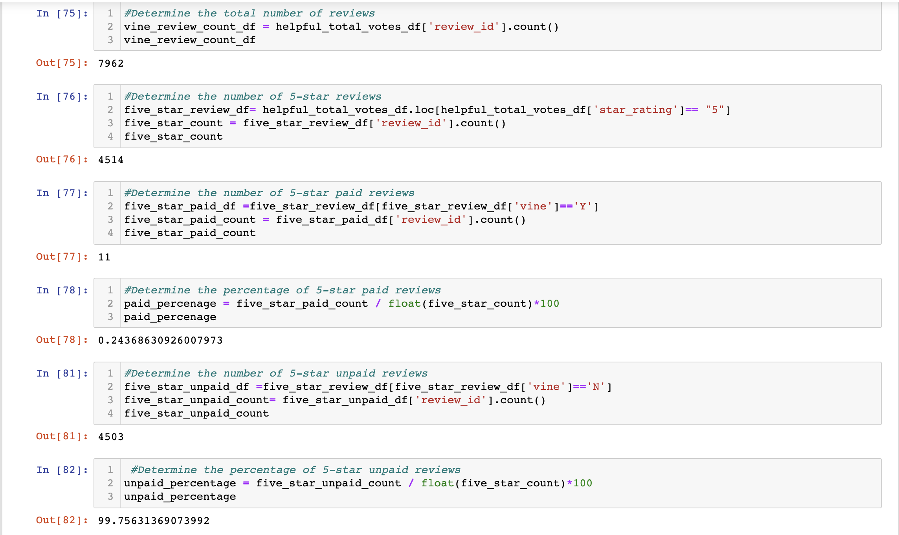

# Amazon_Vine_Analysis

## Overview of the analysis
The Amazon Vine Program is a service that permits manufacturers and publishers to collect reviews for their products from the website. These manufactures are required to pay a fee in order to sell their products to Amazon Vine members; in return these members are required to publish reviews of the items. 

The purpose of this analysis is to analyze the reviews written by members of the paid Amazon Vine Program; I have chosen to specifically examine the dataset for jewellery reviews. I have used PySpark to perform the ETL process which consists of extracting the dataset, transforming the data into a readable form, connecting to an AWS RDS instance, and loading the transformed data into pgAdmin. Following this, I exported the data to a CSV and converted it into a Pandas DataFrame, to determine if there is any bias present from the reviews submitted by Vine Members. 

## Results 
**1.	How many Vine reviews and non-Vine reviews were there?**

There was a total of 7962 reviews; of the total reviews, 21 were reviews written by Vine members and 7941 reviews were written by non-Vine members.   

**2.	How many Vine reviews were 5 stars? How many non-Vine reviews were 5 stars?**

There was a total of 4514 5-star reviews; of the total 5-star reviews, 11 were Vine member reviews and 4503 of the 5-star reviews were non-Vine member reviews. 

**3.	What percentage of Vine reviews were 5 stars? What percentage of non-Vine reviews were 5 stars?**

Overall, approximately 0.24% of the total 5-star reviews were from Vine members, and 99.76% of the reviews were from non-Vine members 

## Summary
The analysis I have conducted on this dataset does not illustrate a positivity bias from the reviews written by members in the Vine program, as only 0.24% of the recorded positive reviews were from these members. Whereas, a majority (99.76%) of the reviews were written by non-Vine members. Therefore, it can be concluded that the reviews written for jewellery products are not biased by Vine members. Although this analysis does exemplify an accurate depiction of the reviews provided in the dataset, I would further this analysis by performing additional 

